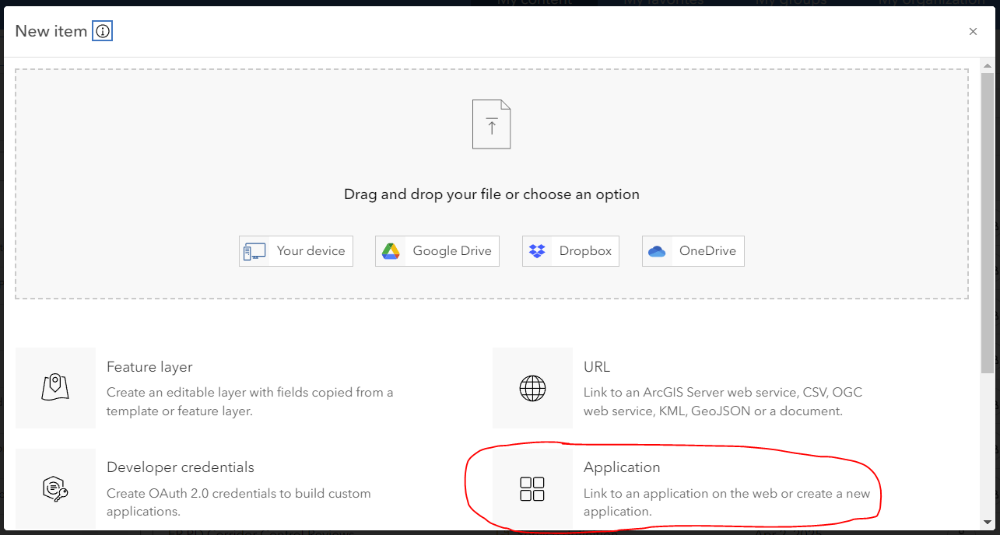
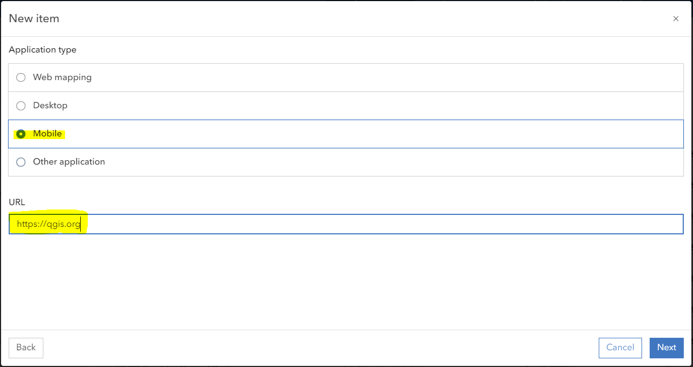
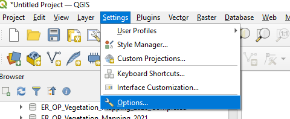
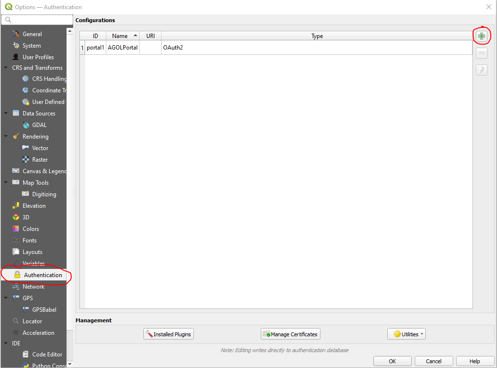
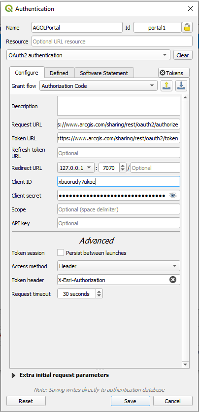
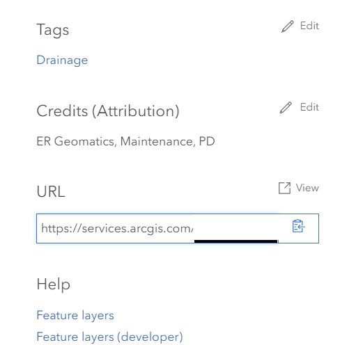
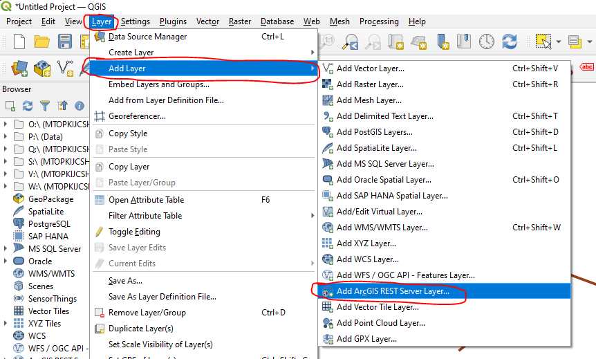
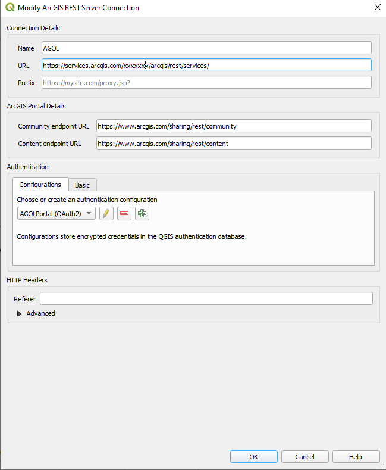

#Accessing ArcGIS Online data from QGIS

## Setting up ArcGIS Online to allow QGIS Connections

### Creating the Connection

Login to ArcGIS Online using your Government of Ontario login credentials. 

Click the content tab and and click the **New Item** button and create a new application.

Change the Application type to Mobile and set the URL to **https://qgis.org** and click next.

Change the **Title** to *QGIS data link*. The other options can be left as default or changed to match your needs. You only need to create this application once for all PCs in your organization as long as it is shared with the rest of your organization.

In your Content page, click on the application and go to its settings. Click the Register application button in the settings menu.

Add the following Redirect URLs:

- localhost
- http://127.0.0.1:7070
- https://127.0.0.1:7070

and set the application enviroment to **Browser** and then click the **Register** button.

Once you are returned to the Application Settings page you'll see there is a **Client ID** and **Client Secret** entry. You should leave this page open as you'll need these values later in QGIS.

## Creating the QGIS Authorization 

Open QGIS and go to *Settings*->*Options*.

Click the *Authentication* tab and then click the green + symbol on the top-right of the dialog box. 

Change the values to the following:

- **Name:** AGOLPortal
- **Id:** portal1
- **Authentication Method:** OAuth2 authentication
- **Grant flow:** Authorization Code
- **Request URL:** https://www.arcgis.com/sharing/rest/oauth2/authorize
- **Token URL:** https://www.arcgis.com/sharing/rest/oauth2/token
- **Client ID** and **Client Secret:** *Use the Client ID and Client Secret generated earlier that can be found in your AGOL application settings page for your registered app.
- **Access method:** Header
- **Token header:** X-Esri-Authorization

Save your changes and close down the Options dialog.

## Add the Data Connection

In ArcGIS Online, navigate to the *Content* tab and locate any data layer. Click the data layer and scroll to the bottom of the *Overview* screen until you see the URL box at the bottom right. Copy the URL Path. You will use this later in QGIS.

In QGIS, open the *Layer* dropdown menu and hover over *Add Layer* and select *Add ArcGIS REST Server Layer...*

In the dialog box, click the *New* button and enter the information as follows:
- **Name:** AGOL
- **URL:** Paste the URL you copied from ArcGIS Online. Remove everything after .../rest/services/. Your URL shoud look like: *https://services.arcgis.com/xxxxxxxx/arcgis/rest/services/*
- **Community endpoint URL:** https://www.arcgis.com/sharing/rest/community
- **Content endpoint URL:** https://www.arcgis.com/sharing/rest/content
- **Authentication:** AGOLPortal (OAuth2)

Click *OK* and then *Connect*. This will load a list of your ArcGIS Online Layers.
