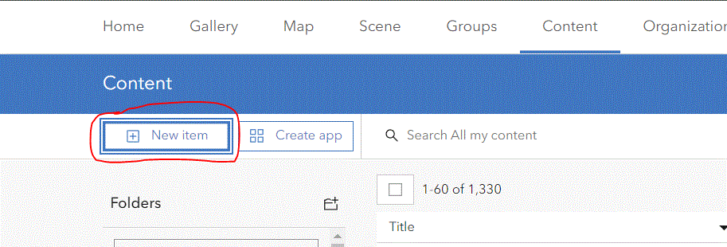

#Accessing ArcGIS Online data from QGIS

## Setting up ArcGIS Online to allow QGIS Connections

### Creating the Connection

Login to ArcGIS Online using your Government of Ontario login credentials. 

Click the content tab and and click the **New Item** button and create a new application.

