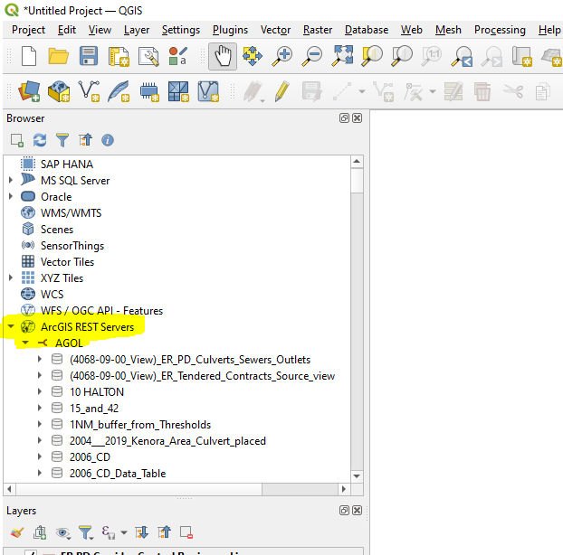
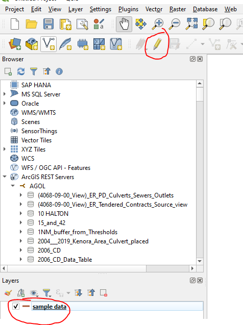
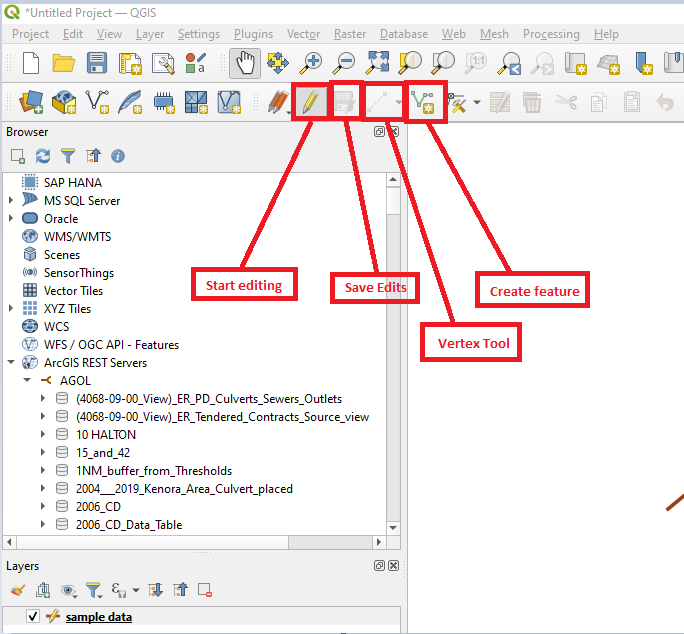

# Editing data in QGIS

Editing data in QGIS is simple and user-friendly. In order to edit a layer in QGIS you need to load the data into QGIS. Most data types can be edited in QGIS' basic install including shapefiles, ArcGIS Online Feature Classes, and GeoPackages (QGIS version of the File Geodatabase).

## Enabling Editing in ArcGIS Online
If you have not connected QGIS to ArcGIS Online yet you need to do that before editing ArcGIS Online Data. You can find the steps to doing this in the [connecting QGIS to ArcGIS Online](getting-started-with-QGIS/connecting-to-agol.md) section of this guide.

Once this connection has been made you need to ensure the ArcGIS Online data has editing enabled in ArcGIS Online. Open ArcGIS Online in a web-browser and login to your ArcGIS Account. Then, navigate to the layer in the Contents tab and open its Settings.
In the *Feature layer (hosted)* section of the Settings page ensure the *Enable editing* combo box is checked. Check the other combo box buttons as required. For more information on editing settings in ArcGIS Online, go to the [Esri Guide to feature layer editing](https://doc.arcgis.com/en/arcgis-online/manage-data/manage-editing-hfl.htm)

Once you have editing enabled on your feature layer in ArcGIS Online, you can load the data into QGIS by navigating to the *ArcGIS REST Servers* tab in the browser box at the left side of the map pane in QGIS.

## Editing Tools in QGIS

All data in QGIS is edited the same way regardless of its data type. So, ArcGIS Online features are edited the same way as shapefiles or spatial database data. If you are familiar with editing in ArcGIS Desktop or Pro you will be familiar with these tools.

To start editing data, highlight the layer you want to edit in the *Layers* box at the bottom left of your QGIS window and click the yellow pencil button.

There are some basic editing functions that we will go through in this guide but, for more advanced editing, you should go to [the QGIS Editing guide](https://docs.qgis.org/3.40/en/docs/user_manual/working_with_vector/editing_geometry_attributes.html)

### Drawing a new feature

To draw a new feature in QGIS you need to start an editing session, if you haven't already, and click the *Add new feature* button. Then, click on the map where you want your feature to be if it is a point, or start if it is a line or polygon.
If you're drawing a line or polygon, once you have finished adding the vertices, right-click on your mouse and an attribute window will appear where you can edit the features attributes before writing the feature to memory. Once you have finished drawing your new features click the *Save edits* button to the right of the *Start editing* button. This will write your features from memory to the feature class.

### Editing an existing feature

Editing an existing feature is similar to creating a new feature. If you want to edit the spatial data of a feature you can start an editing session and then click *Vertex tool* button. Then, hover over the feature to where the vertices are and move the vertices as needed. Once done, click the save edits button.

To edit the tabular data of a feature, open the attribute table of the feature by right-clicking the layer in the *Layers* window and selecting *Open Attribute Table* from the menu. Then, double click inside the row and column you want to edit. You can select the layer in the map to highlight that layer in the attribute table.
